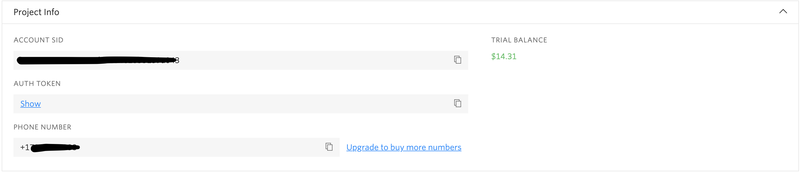
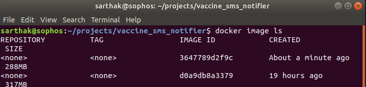
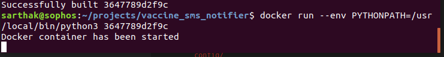

# Vaccine SMS Notifier

[![License][badge-license]][badge-url-license]

_Your personal vaccine slots tracker_

## Description

A platform independent application which sends an _sms_ to your phone when vaccination slots are available for a particular pincode within the next **30 days**. It checks for slots **every minute**. If a slot is available it will send you an SMS at that instant only. If a slot is not available, it will not send an SMS.

## Prerequisites
1. Docker installation (Any version should work) - (Recommended)[Installation for Mac](https://docs.docker.com/docker-for-mac/install/), [Installation for Windows](https://docs.docker.com/docker-for-windows/install/), [Installation for Ubuntu](https://docs.docker.com/engine/install/ubuntu/)(Recommeded)

2. A [Twilio](https://www.twilio.com/referral/VSHv83) account - Open a free account(credit card not required). Create a trial phone number. When you go to the **console** menu, you'll see an interface like this:




You would need these details later...

**Note**: Twilio offers a free account with a limit of around _100 messages_. Can be more or less. Use the above [link](https://www.twilio.com/referral/VSHv83) to get $10 dollar extra credit if you upgrade.


## Usage

Please do the below given steps very carefully...

1. Clone the repository using
```bash
$ git clone https://github.com/sarthakgupta072/vaccine_sms_notifier.git
```

2. Go to _config_ folder under the main _vaccine_sms_notifier_ folder.
```bash
Via Terminal
$ cd vaccine_sms_notifier/config
```
3. Update the values in the file by referring the Twillio console info as shown above. The _PHONE_ field will contain _Twillio Phone number_ and not your personal phone number. Save the file. (This is a sensitive file, please donot share with anyone). You can use any text editor to do this.
```bash
Via Terminal
$ nano sms_config.py
```

4. Open the _app_config.py_ and update your _pincode_, _age_ and _phone_number_. Enter the phone number **without** _+91_ prefix. Save this file and go to the _vaccine_sms_notifier_ folder again. You can use any text editor to do this.
```bash
Via Terminal
$ nano app_config.py
```

5. Build the docker image
```bash
$ docker build .
```

6. Copy the _Image ID_ of the latest image.
```bash
$ docker image ls
```
Copy the _Image ID_ of the top image. (as shown below _3647789d2f9c_)


7. Run this command to start the application in the container
```bash
$ docker run -it --env=PYTHONPATH=/usr/local/bin/python3 <IMAGE_ID>
```

_Eg: ```$ docker run -it --env PYTHONPATH=/usr/local/bin/python3 3647789d2f9c```_


After this you'll see that the application starts running. You can check if the application container is running by doing ```docker ps```. And you'll see a new container there. Also you can open the docker desktop application and see your info there.



**DO NOT close the terminal as it will kill the container/application also. Better option is to minimise the terminal**

If slots are available, you'll get a message as shown below(format subjected to change based on feedback)


### How to test if my application is working or not?
For testing purpose, change your age to anything > 45 years and select a pincode for which slots are available for 45+ ages. Then follow the steps from _Step 5_. After your application is running, you should receive a message every other minute. Close the terminal after confirmation.


### What to do if I accidently closed my terminal session?
Follow the instructions from Step 6 again.

**OR**

See the stopped container by doing ```$ docker ps -a```. Copy the container ID of the stopped contained and start the container using ```docker start <CONTAINER_ID>```

### What to do if I don't want these SMS alerts any more?
After you book a vaccine session successfully or you don't want these sms on you phone. Stop the container by closing the terminal window.

### What to do if I want SMS Alerts for multiple pincode?
You can build an image(Step 5) with different pincodes, and run the application/container for each of those pincodes.


## Contributing

Feel free to open an issue or a PR to address an issue.


## Versioning

The project is still in BETA state. Changes ca be made regulary based on feedback.

## License

This project is covered by the [Apache License 2.0][license-apache] also
[shipped with this repository][license].


[badge-license]: <https://img.shields.io/badge/license-Apache%202.0-blue.svg>
[badge-url-license]: <http://www.apache.org/licenses/LICENSE-2.0>
[license]: LICENSE
[license-apache]: <https://www.apache.org/licenses/LICENSE-2.0>

